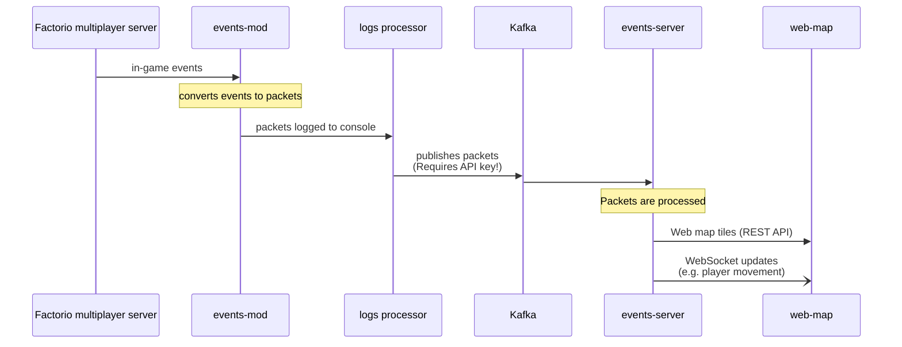

# Kafkatorio

[Kafkatorio](https://github.com/adamko-dev/kafkatorio) is a platform used for creating
[Factorio](https://www.factorio.com/) mods that require communication with an external server.

Development is ongoing.

At present Kafkatorio is used to create a [live-view web map](https://factorio.adamko.dev), that
shows the current status of a Factorio server, and any connected players.

However, Kafkatorio can be used for more than this. It has the potential to export metrics, and
allow for inter-server communication.

Kafkatorio was created to explore the possibilities of using
[Apache Kafka](https://kafka.apache.org/) to process updates from a Factorio server.

### Running

[Instructions for running a Kafkatorio instance are available in the docs](./docs/guide.md).

### Overview

This is a brief overview of how Kafkatorio gathers data, processes it, and uses it to create the
live web-map.

Kafkatorio receives updates from a Factorio server, processes them, and exposes them over a REST
and WebSocket APIs.

1. The Kafkatorio game mod, [`events-mod`](./modules/events-mod), collects event data, de-bouncing
   and grouping events, and converts them to JSON packets
2. `events-mod` prints the packets to the Factorio game server logs
3. The Factorio logs are forwarded to a Kafka cluster, either using
    * [syslog](https://docs.docker.com/config/containers/logging/syslog/) (using Docker logging
      plugin)
    * or [Kafka Pipe](./modules/infra-kafka-pipe) (a script that reads the server logs and forwards
      them to a Kafka topic)
4. The packets are consumed by [`events-server`](./modules/events-server), which processes the
   packets using Kafka Streams, creating and hosting map tiles.

   `events-server` serves the map tiles via a REST API, and produces WebSocket messages regarding
   updates (for example, when a player's location has changed).
5. The `web-map` uses Leaflet/JS to display the map, using the tiles and WebSocket messages from
   `events-server`

## License

While this project is under development, [no license](https://choosealicense.com/no-permission/)
is provided.
