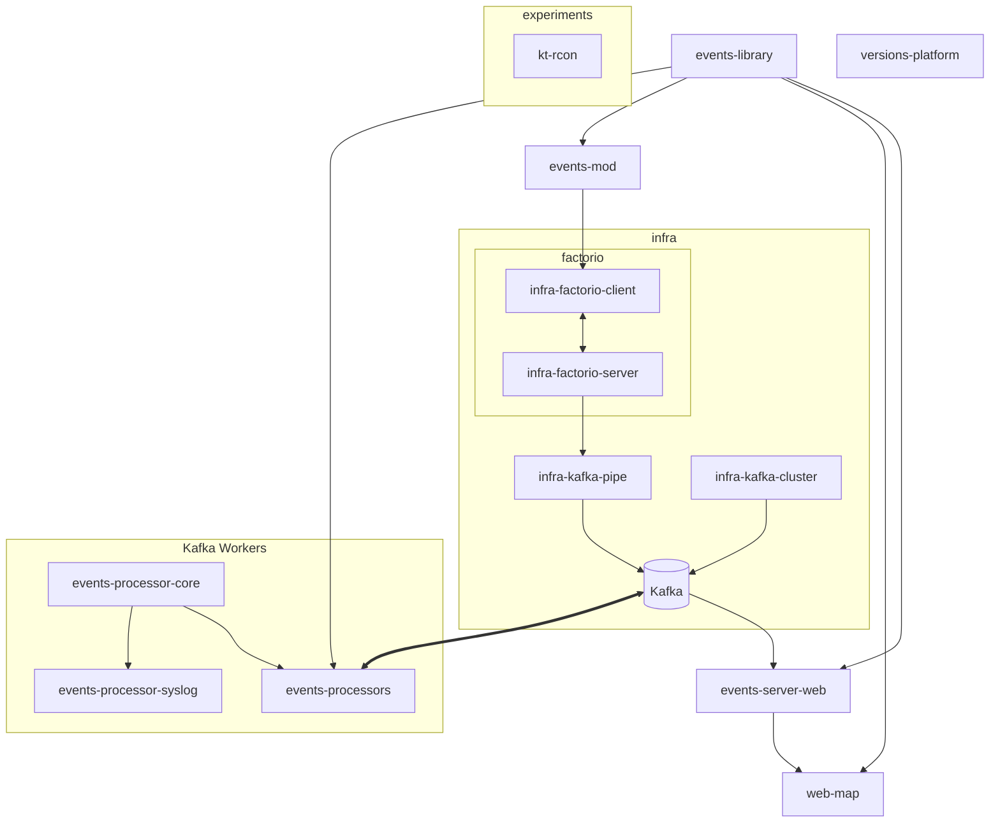

```mermaid
flowchart TD

events-library-->events-processors & events-mod & web-map & events-server-web

kafka[(Kafka)]


events-mod-->infra-factorio-client


subgraph Kafka Workers
events-processor-core --> events-processor-syslog &  events-processors
end

kafka<==>events-processors

subgraph infra
subgraph factorio
infra-factorio-client<-->infra-factorio-server
end
infra-factorio-server-->infra-kafka-pipe
infra-kafka-pipe-->kafka
infra-kafka-cluster-->kafka
end

kafka-->events-server-web

events-server-web-->web-map

versions-platform

subgraph experiments
kt-rcon
end
```
